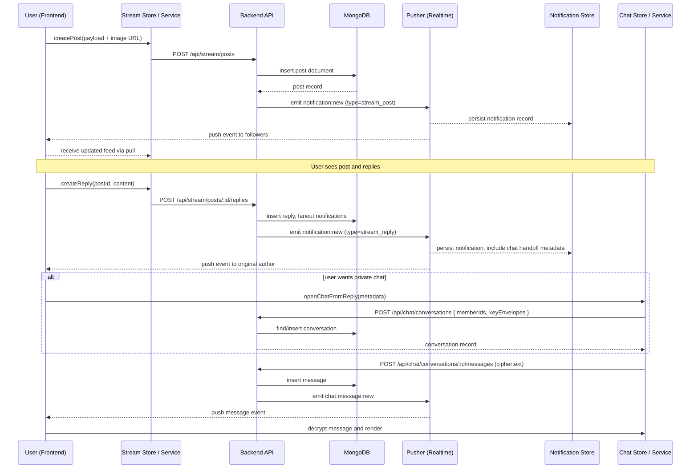

# Stream & Chat Flow Diagram

This diagram illustrates the primary end-to-end sequence for a social stream post
and subsequent chat interaction. It can be referenced by developers and
new contributors to understand how data moves through the system.


```

> **Note**: this sequence omits error paths and authorization checks for brevity.
> Refer to `ARCHITECTURE_GUIDELINES.md` for security and capability details.
